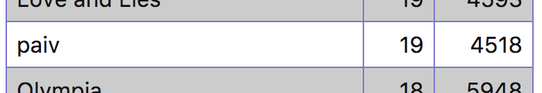

paiv - icfpc 2017
=================

* http://2017.icfpcontest.org/
* https://icfpcontest2017.github.io/


[](boston.gif)


Implementation
--------------

* Python (lightning submission, online-offline runner)
* C/C++ (final submission)
* JS (server, post-event)


Results
-------

#### Lightning

Eliminated in round I (38/52)



#### Full

Unfortunately submission had a bug introduced in last hour of coding, and
was crashing for orgs.

```
[20:45] <@dhil> Segmentation fault
[21:32] <paiv> dhil: found my bug. That code can play only with options enabled.
Rush hour mess, blame me
```


Notes
-----

Read here: https://paiv.github.io/blog/2017/08/09/icfp-contest-punting.html
