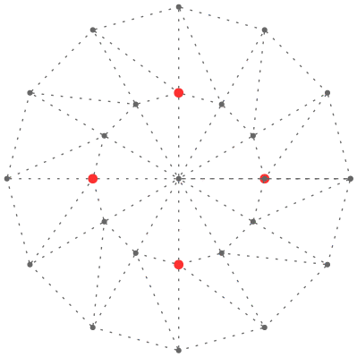

paiv - icfpc 2017
=================

http://2017.icfpcontest.org/
https://icfpcontest2017.github.io/

Implementation
--------------

* Python (lightning submission, online-offline runner)
* C/C++ (final submission)

Results
-------
_to be posted_

Notes
-----

Lightning submission was a random trails player with a preference to grab rivers
attached to mines. Spent considerate time on unbuffered I/O, interprocess streams
and changes to offline protocol.

Lightning was fully in Python, but then I decided to compensate my poor algorithmic
skills with C/C++ performance. So there goes another day rewriting random player
in C/C++, where I spent considerate time parsing JSON.

Day three started with adopting splurges extension. Then I had score tracked throughout
the game, so could choose from best moves.

After a sleep brake (timezones), added support for options extension. Then a rush
final stretch for monte-carlo-esque player, with final half-hour bug chase.
(Have used 15 minutes into added time, thank you orgs).

Not having futures and splurges extensions in player, thus low ranks expected.
